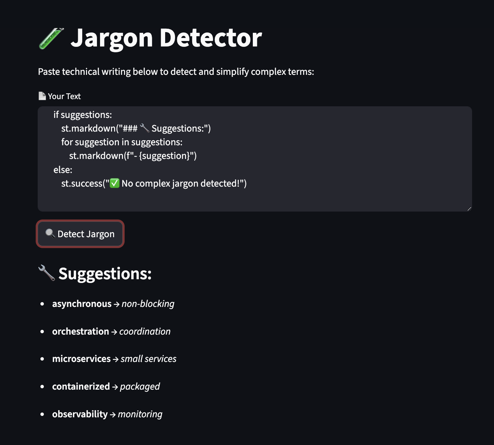

# 🧪 Jargon Detector

This tool analyzes technical writing and detects complex or buzzword-heavy jargon. It highlights terms that may be difficult to understand and suggests simpler alternatives, making your documentation clearer and more accessible — ideal for onboarding, documentation, or user education.

---
## 🚀 Getting Started

Follow these steps to set up and run the Jargon Detector Locally:

1. Clone the Repository
```bash
git clone https://github.com/your-username/your-repo-name.git
cd your-repo-name/projects/jargon-detector
```
2. Set up a Virtual Environment (optional but recommended)
```bash
python3 -m venv venv
source venv/bin/activate  # On Windows: venv\Scripts\activate
```
3. Install Dependencies
```bash
pip install -r requirements.txt
```
If you don't have a requirements.txt file, you can instead install manually:
```bash
pip install spacy
```
---
## 🔧 Usage

1. Add your technical writing to `sample.txt`.
2. Run the script:

```bash
python3 detector.py
```
---

#### 2. 🤝 **Contributing**
> Let others know how to contribute to the project.

```md
## 🤝 Contributing

Contributions are welcome!  
If you find a bug or want to suggest improvements, feel free to open an issue or submit a pull request.

## 📄 License

This project is open-source and available under the [MIT License](LICENSE).

---

## 🙋‍♀️ Contact

Created by [@yourusername](https://github.com/yourusername) – feel free to reach out!

---

## ⚙️ How It Works

The Jargon Detector uses Natural Language Processing (NLP) techniques to identify complex terms in a body of text. It relies on:

* spaCy, a Python NLP library, to tokenize and analyze the input text.

* A predefined mapping of jargon terms to plain English equivalents.

* Optionally, you can customize or expand this mapping for different domains.
```
---

## 💡 Features

* Detects complex jargon in technical writing

* Recommends simpler replacements

* Easy-to-run Python script

* Customizable jargon mapping

* Output displayed directly in the terminal

---

### 📸 Screenshot


